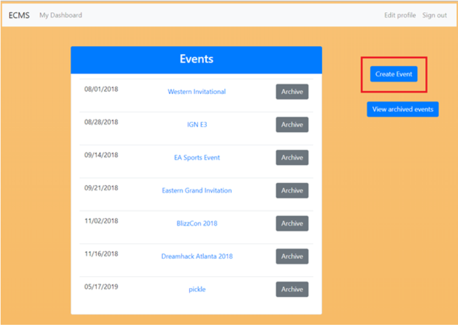
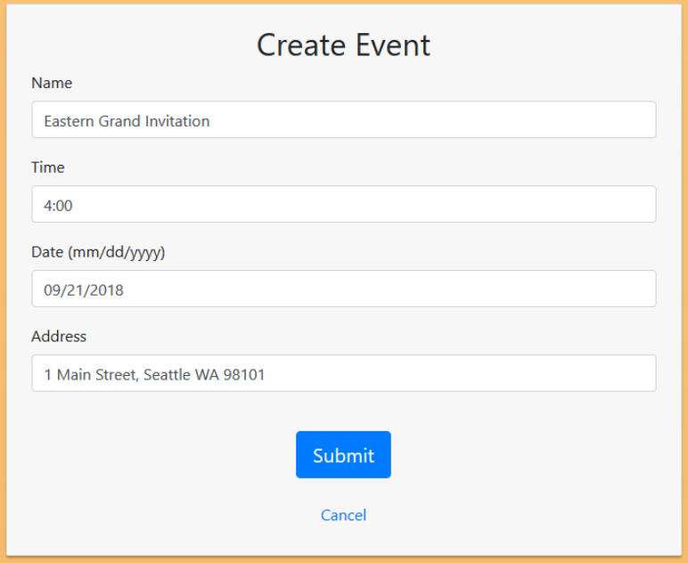
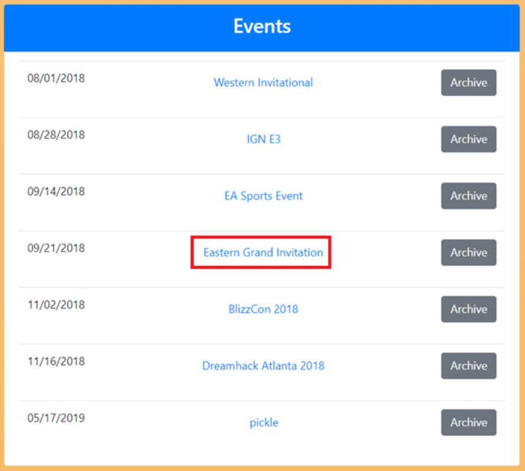
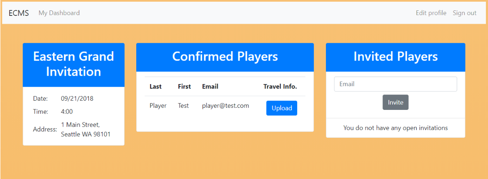
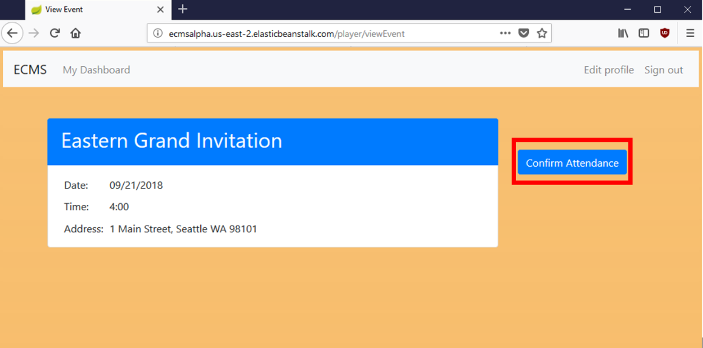
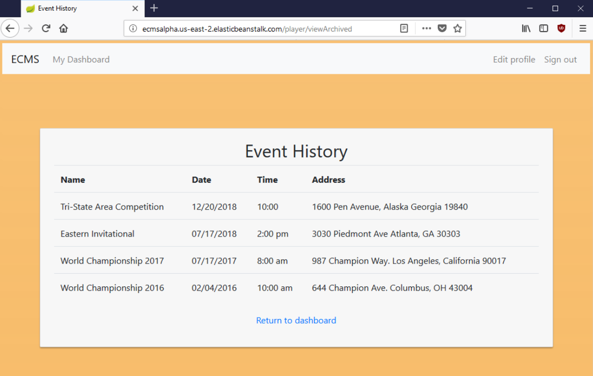

# ECMS

<h3>Project Summary</h3>

Our group has decided to build an event coordinating management software for gamers and gaming companies. The point of this software will be to help assist the event coordinators in getting the information to the players in a central location, versus via email or across multiple platforms. This software will separate admins and players during the login process, and show the appropriate pages. 

Our software will also address one of the main problems of the event coordinator’s issues in the gaming company. This would be that there is an issue with the players that do not have a suitable platform to go to for their travel and event information, while also allowing the event coordinators to get the information to the players in a simple and organized fashion.  The platform currently used by gaming companies is very inefficient because although the admins have a database of players and events, they will have to communicate with players and event attendees individually and update any changes to player/event information themselves. The existing system is also not efficient to players because they are asked the same information multiple times when they plan to attend more than one event, and they do not have a centralized place to look at their past activities and their to-dos before their next travel. Our software  will essentially help reduce cost and time for the company, and make sure that everyone is on the same page about event and travel information. 
 
This software will also give players access to their own profile (that will not be seen by anyone but them and the event coordinator), which has information about the events they have attended, signed up for, and will be available to them. They will also have access to their travel information and travel checklist if they are planning to attend events with the gaming company. If they should have any questions, there will be a communication box available to them if they need to reach an admin.

Now, on the admin’s side, the software will be able to access player’s and event’s information, along with an option to add/update player’s travel info. The software will also allow the coordinator to export the all the information, making it easy to do get data to other services that will help with the event, such as a car service. It will simplify coordinating events for the coordinators and help reduce the problems with communicating with players.

This will help companies to save on cost with how much time it would cost to employ multiple people to do a job that could be done by two. Also it is a software that can be utilized in not only the esports production side, but other businesses that want to do in house travel for clients and businesses. Making it simple and easy to use by both parties.

We are confident that the system can be built utilizing Java with the IntelliJ IDEA, mySQL to handle the database, and HTML to design the front-end experience. Our group has considered the time limitation and the collective knowledge and experience of our group members when deciding to build this project, and we are very confident that we will be able to deliver. The project will be an exciting way for our team to experience designing a modern web application as well as learning new implementation, design, and integration techniques.

<h3>Development Tools</h3>

When it came time to implement our design, we first had to pick IntelliJ IDEA as our Integrated Development Environment (IDE). We chose IntelliJ because it is feature rich and widely used in the market for Java. Since Java is the language most of us are familiar with, we chose Spring Boot, a popular Java-based framework for building web applications. We chose Spring because it provides a wide variety of features that we could pick and choose as best suited our needs.
 
Along with Spring Boot, we included several Maven dependencies. We used thymeleaf, which enabled us to use raw HTML for the front end as opposed to creating JavaServer Pages. Because we were using raw HTML, we were able to use Bootstrap, a front-end component library, to create clean, responsive, and modern pages. 

For our Relational Database Management System, we chose MySQL because it is open source and we have group members with experience working with it. 

To deploy the application, we chose Amazon Web Services (AWS) to host our application and our database. We chose AWS because of it is a widely used tool for web hosting, and the process to upload and maintain the application was painless and did not require us to download or learn any difficult software. 

<h3>User Guide</h3>

<h5>Sign Up/Log In:</h5>

1. Once you arrive at the landing page, you will be directed to log in or register for an account. 

2. To register for an account, click here on the home page:

3. You will register for an account. If you are an administrator for your company, make sure you have your company’s admin code, otherwise you will be registered as a player. If you are a player, leave the “Admin Code” box blank. 

4. Now you can log in using the account you just created and you will be directed to the dashboard for your user type, admin or player. 

<h5>Admin Create Event/Invite Player:</h5>

1. On the admin dashboard, pictured below, click on “Create Event” to be directed to the Create Event page. 

2. To create an event, simply enter all the required fields, pictured below, and click submit to create the event. 

3. Once you submit the event, you will be redirected to the dashboard where you new event will be listed with the other events, based on chronological order. Click on the event to add players to the event. 

4. On the right hand side of the “View Event” page, you will see the list of “Invited Players”. To add a player to the event, simply add their email address and click “Invite” and they will be notified they have been invited to the event. 

5. Once a player logs in to their dashboard and confirms their attendance, they will be moved from the “Invited Players” list, to the “Confirmed Players” list on the event page. 

<h5>Player Confirm Attendance/View Past Events:</h5>

1. Once you are logged in as a player, you will be directed to your player dashboard, pictured below, where you can view your “Confirmed Events”, “Invited Events” and “Event History”. 

2. To view an event, select an event on your “Invited Events” list and you will be directed to the “View Event” page for that event where you will be able to view the information about the event as well as confirm your attendance. To confirm your attendance, simply click on the “Confirm Attendance” button and the event will be moved to your list of “Confirmed Events”.

3. To view your past events, simply click on the “Event History” button on your dashboard and you will be directed to a page with a table listing your event history, an example is pictured below.

<h3>Development Team</h3>

Thanks to,

Mark Lynch, Chang Moon, Roy Njeru, Dmitiri Shan, and Selam Tsegaye